# EX-05-Feature-Generation

## AIM
To read the given data and perform Feature Generation process and save the data to a file. 

# Explanation
Feature Generation (also known as feature construction, feature extraction or feature engineering) is the process of transforming features into new features that better relate to the target.
 

# ALGORITHM
### STEP 1
Read the given Data
### STEP 2
Clean the Data Set using Data Cleaning Process
### STEP 3
Apply Feature Generation techniques to all the feature of the data set
### STEP 4
Save the data to the file

# CODE
Devloped by: Arshatha

Register No.: 212222230012

## Encoding Data.csv

import pandas as pd

df=pd.read_csv('Encoding Data.csv')

df.head()

df['ord_2'].unique()

from sklearn.preprocessing import LabelEncoder,OrdinalEncoder

climate = ['Cold','Warm','Hot']

en= OrdinalEncoder(categories = [climate])

df['ord_2']=en.fit_transform(df[["ord_2"]])

df

le = LabelEncoder()

df['Nom_0'] = le.fit_transform(df[["nom_0"]])

df

!pip install --upgrade category_encoders

from category_encoders import BinaryEncoder

be = BinaryEncoder()

data = be.fit_transform(df['bin_1'])

df  = pd.concat([df,data],axis=1)

df

be = BinaryEncoder()

data = be.fit_transform(df['bin_2'])

df  = pd.concat([df,data],axis=1)

df

## Data.csv

df1 = pd.read_csv("data.csv")

df1.head()

df1['Ord_1'].unique()

climate = ['Cold','Warm','Hot','Very Hot']

en= OrdinalEncoder(categories = [climate])

df1['Ord_1']=en.fit_transform(df1[["Ord_1"]])

df1

df1['Ord_2'].unique()

cl = ['High School','Diploma','Bachelors','Masters','PhD']

en= OrdinalEncoder(categories = [cl])

df1['Ord_2']=en.fit_transform(df1[["Ord_2"]])

df1

le = LabelEncoder()

df1['City'] = le.fit_transform(df1[["City"]])

df1

from category_encoders import BinaryEncoder

be = BinaryEncoder()

dat = be.fit_transform(df1['bin_1'])

df1  = pd.concat([df1,dat],axis=1)

df1

from category_encoders import BinaryEncoder

be = BinaryEncoder()

data1 = be.fit_transform(df1['bin_2'])

df1  = pd.concat([df1,data1],axis=1)

df1

## Titanic_dataset.csv

df2 = pd.read_csv("titanic_dataset.csv")

df2.head()

be = BinaryEncoder()

data2 = be.fit_transform(df2['Sex'])

df2  = pd.concat([df2,data2],axis=1)

df2

df2 = pd.get_dummies(df2, prefix=['Embarked'] ,columns=['Embarked'])

df2

# OUTPUT

## Encoding Data.csv
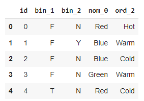

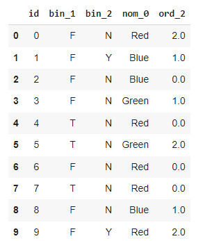

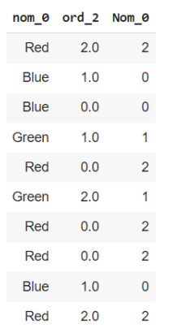

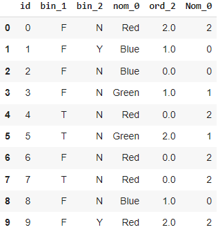

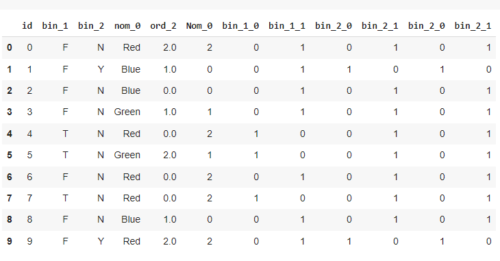

## data.csv

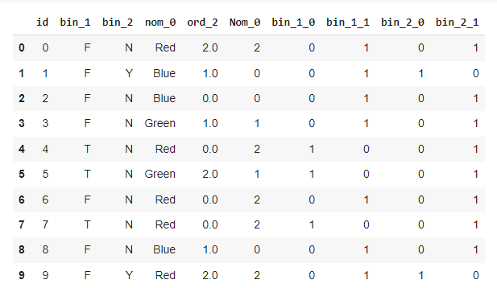

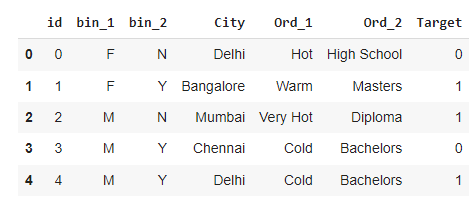

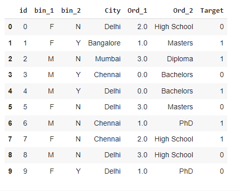

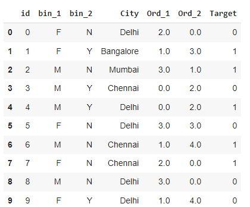

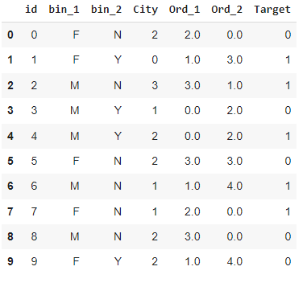

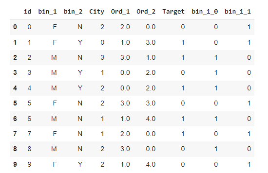

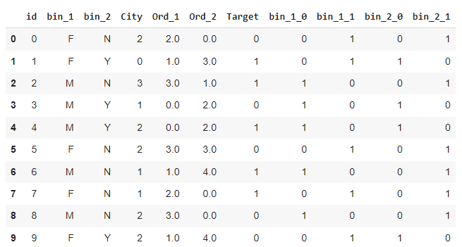

## titanic_dataset.csv
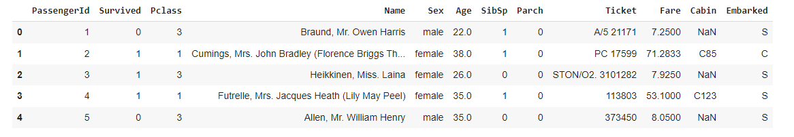

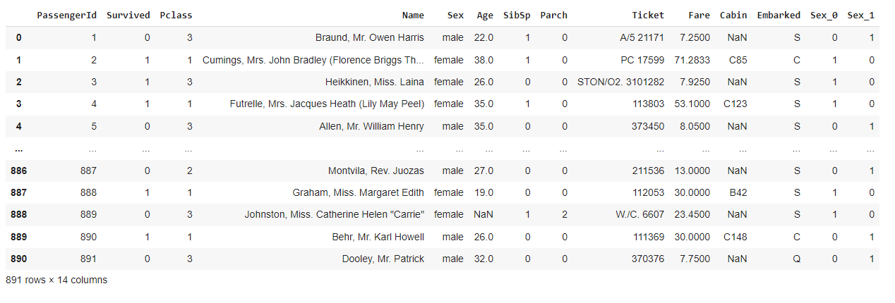

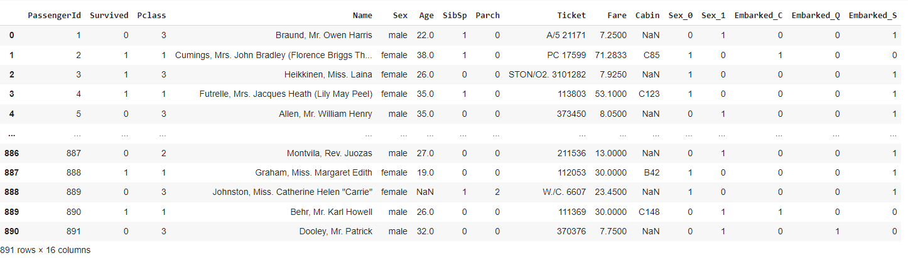

# RESULT

The Feature Generation process was performed and saved the data to a file.

